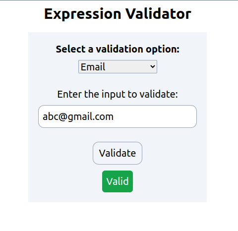

# Expression Validator



## Overview

This project is a JavaScript assignment developed for Bohubrihi, an online learning platform. It implements a expression validator using the following technologies:

- HTML
- JavaScript
- Tailwind CSS
- Vite for bundling
- GitHub (Version Control)
- Vercel (Deployment)

## Project Description

The Expression Validator project aims to create an interactive Expression Validator application. Users can validate email, phone number and postal code. It demonstrates proficiency in web development technologies and JavaScript programming.

## Features

- Validate email, phone number and postal code.

## How to Run

To run this project locally, follow these steps:

1. Clone the repository from GitHub:

   ```bash
   git clone
   ```

2. Navigate to the project directory:
   ```bash
   cd
   ```
3. Install project dependencies:

   ```bash
   npm install
   ```

4. Start the development server:

   ```bash
   npm run dev
   ```

## Deployment

This project is deployed on Vercel. You can access the live demo <a href="" target="_blank">here</a>.
